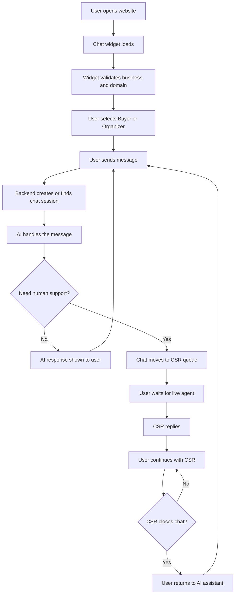
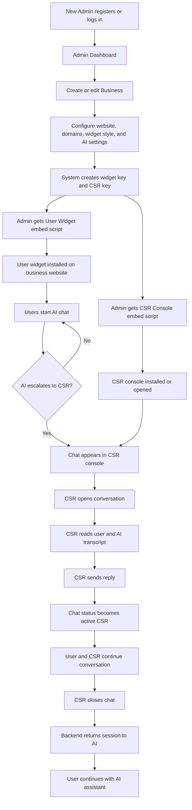

# Admin, User, and CSR Flow

## User Flow



## New Admin and CSR Flow



# Admin, User, CSR, and Backend Application Flow

This document explains how the chat widget manager works from admin setup to user chat, AI response, CSR handoff, and return back to AI.

## 1. High-Level Application Flow

```text
Admin creates business
      ↓
System generates widget key and CSR key
      ↓
Admin embeds user chat widget on website
      ↓
User opens website and starts chat
      ↓
Backend validates widget and creates chat session
      ↓
AI handles normal messages
      ↓
If AI decides human support is needed
      ↓
Chat is moved to CSR queue
      ↓
CSR replies from CSR dashboard/application
      ↓
CSR closes chat
      ↓
User is returned back to AI assistant
```

## 2. Admin Flow

The admin is the business owner or operator who configures the chat system.

```text
Admin Register / Login
      ↓
Dashboard
      ↓
Create or Edit Business
      ↓
Enter business details:
  - Business name
  - Website
  - Authorized domains
  - Widget colors and text
  - AI webhook settings
  - Optional external CSR API endpoint
      ↓
System generates:
  - widget_key for customer-facing chat widget
  - csr_key for CSR dashboard/widget
      ↓
System creates linked CSR business record
      ↓
Admin copies embed scripts:
  - User widget script
  - CSR console script
      ↓
Admin can monitor:
  - Sessions
  - Logs
  - API calls
  - Main database
  - CSR database
```

Important backend routes:

```text
/register
/login
/dashboard
/business/new
/business/<business_id>/edit
/database-admin
/logs
/sessions/<session_id>
```

## 3. User Chat Widget Flow

The user is the visitor on the business website.

```text
Website loads user embed script
      ↓
/embed/<widget_key>.js
      ↓
authenticated-chat-widget.js loads in browser
      ↓
Widget creates visitor_id
      ↓
Widget validates itself with backend
      ↓
/validate_widget
      ↓
Backend checks:
  - widget_key exists
  - business is active
  - domain is authorized
      ↓
Widget shows chat UI
      ↓
User selects Buyer or Organizer
      ↓
User sends message
      ↓
/api/chat
      ↓
Backend creates or reuses ChatSession
      ↓
Backend saves user ChatMessage
      ↓
If session is active_ai:
  send message to AI webhook
      ↓
AI response is saved
      ↓
Response is returned to widget
```

Important frontend/backend APIs:

```text
/embed/<widget_key>.js
/widget-assets/authenticated-chat-widget.js
/validate_widget
/api/chat
/api/chat/poll
```

## 4. Backend AI Flow

This is the normal AI path.

```text
User Message
      ↓
Chat Trigger
      ↓
Input Normalization
      ↓
Business Lookup by widget_key
      ↓
Domain Validation
      ↓
ChatSession Lookup / Create
      ↓
Save User Message
      ↓
AI Agent Processing
      ↓
Intent Detection
      ↓
Query Relevant Knowledge Bases
      ↓
Policies / Events / Blogs / General Info
      ↓
OpenAI / n8n Response Generation
      ↓
Save AI Response
      ↓
Check if AI response requests CSR handoff
      ↓
Return Final Response to User
```

The backend posts to the AI webhook using this payload style:

```text
action: sendMessage
chatInput: user message
prompt: user message
namespace: business namespace
sessionId: visitor id
mode: current chat session status
user_type: Buyer or Organizer
```

## 5. AI to CSR Handoff Flow

The chat is transferred to CSR when the AI response contains handoff language.

Examples of trigger phrases:

```text
connect you with an agent
connect you to an agent
connect you with a human
human agent
live agent
agent shortly
transferring you to
hand you over to
escalate your request
```

Flow:

```text
AI response generated
      ↓
Backend checks response text
      ↓
Does response contain CSR trigger phrase?
      ↓
YES
      ↓
ChatSession status changes:
  active_ai → pending_csr
      ↓
Backend creates transcript summary
      ↓
Backend syncs main chat session to CSR database
      ↓
CSR conversation is created or updated
      ↓
All existing user/AI messages are copied to CSR conversation
      ↓
If external CSR API endpoint exists:
  backend calls external_url/init
      ↓
User widget receives mode: pending_csr
      ↓
User waits for live agent
```

Main sync function:

```text
sync_chat_session_to_csr(chat_session, business)
```

This creates or updates:

```text
CsrBusiness
CsrConversation
CsrConversationMessage
```

## 6. CSR Dashboard / CSR Application Flow

The CSR is the support agent handling escalated chats.

```text
CSR dashboard loads CSR embed script
      ↓
/embed/csr/<csr_key>.js
      ↓
csr-dashboard-widget.js loads
      ↓
CSR widget polls for active chats
      ↓
/api/csr/chats
      ↓
Backend returns conversations with status:
  - pending_csr
  - active_csr
      ↓
CSR selects a conversation
      ↓
/api/csr/messages/<session_id>
      ↓
CSR reads synced transcript
      ↓
CSR writes reply
      ↓
/api/csr/reply
      ↓
Backend saves CSR message in main chat database
      ↓
Backend saves CSR message in CSR database
      ↓
If status was pending_csr:
  pending_csr → active_csr
      ↓
User widget polls /api/chat/poll
      ↓
User receives CSR message
```

Important CSR routes:

```text
/embed/csr/<csr_key>.js
/widget-assets/csr-dashboard-widget.js
/api/csr/chats
/api/csr/messages/<session_id>
/api/csr/reply
/api/csr/close
```

## 7. User Flow While CSR Is Active

When CSR is handling the chat, AI is paused.

```text
User sends message
      ↓
/api/chat
      ↓
Backend sees ChatSession status:
  pending_csr or active_csr
      ↓
Backend saves user message
      ↓
Backend syncs message to CSR database
      ↓
Backend does not call AI webhook
      ↓
If external CSR API endpoint exists:
  backend calls external_url/send
      ↓
Response to widget has empty output
      ↓
CSR dashboard polling sees new user message
```

In CSR mode, user messages are routed to the human agent instead of AI.

## 8. CSR Back to AI Flow

When the CSR finishes, the chat is returned to AI.

```text
CSR clicks Close Chat
      ↓
/api/csr/close
      ↓
Backend calls resolve_csr_conversation()
      ↓
Main ChatSession changes:
  active_csr or pending_csr → active_ai
      ↓
chat_session.csr_id is cleared
      ↓
Backend adds AI/system message:
  "You are now connected back to the AI assistant."
      ↓
CSR conversation status changes:
  active_csr or pending_csr → resolved
      ↓
Resolved message is also copied to CSR conversation messages
      ↓
User widget polling receives the resolved message
      ↓
Widget switches back to AI mode
      ↓
Next user message goes to AI webhook again
```

Important backend function:

```text
resolve_csr_conversation(conversation)
```

## 9. External CSR API Flow

The app also supports an external CSR system using `csr_key`.

External CSR system can call:

```text
GET  /api/v1/external/csr/chats?csr_key=<csr_key>
GET  /api/v1/external/csr/messages/<session_id>?csr_key=<csr_key>
POST /api/v1/external/csr/reply
POST /api/v1/external/csr/close
```

External reply flow:

```text
External CSR app gets chats
      ↓
External CSR app gets messages
      ↓
CSR replies from external app
      ↓
/api/v1/external/csr/reply
      ↓
Backend saves CSR reply
      ↓
User widget receives reply through /api/chat/poll
```

External close flow:

```text
External CSR app closes chat
      ↓
/api/v1/external/csr/close
      ↓
Backend resolves CSR conversation
      ↓
User returns to AI
```

## 10. Session Status Meaning

```text
active_ai
  Normal AI mode.
  User messages are sent to the AI webhook.

pending_csr
  AI has escalated the chat.
  The user is waiting for CSR to reply.

active_csr
  CSR has replied and is actively handling the chat.
  User messages go to CSR, not AI.

resolved
  CSR-side conversation is closed.
  Main chat session is back to active_ai.
```

## 11. Database Flow

Main chat database:

```text
User
Business
ChatSession
ChatMessage
WidgetApiLog
```

CSR database:

```text
CsrBusiness
CsrConversation
CsrConversationMessage
CsrWidgetApiLog
```

Relationship:

```text
Business
      ↓ linked by business id
CsrBusiness

ChatSession
      ↓ linked by chat session id
CsrConversation

ChatMessage
      ↓ linked by chat message id
CsrConversationMessage
```

## 12. Complete Combined Flow

```text
Admin
  ↓
Creates business
  ↓
Gets widget_key and csr_key
  ↓
Embeds user widget and CSR widget
  ↓

User
  ↓
Opens website
  ↓
Widget validates domain and widget key
  ↓
User sends message
  ↓

Backend
  ↓
Creates ChatSession
  ↓
Saves user message
  ↓
Calls AI webhook
  ↓
Saves AI response
  ↓

Decision
  ↓
If normal answer:
  response goes back to user
  ↓
If AI asks for human:
  session becomes pending_csr
  transcript syncs to CSR database
  ↓

CSR
  ↓
CSR dashboard sees pending chat
  ↓
CSR opens transcript
  ↓
CSR replies
  ↓
session becomes active_csr
  ↓
User and CSR continue chat
  ↓

Close
  ↓
CSR closes chat
  ↓
session becomes active_ai
  ↓
resolved message is sent to user
  ↓
User continues with AI
```

