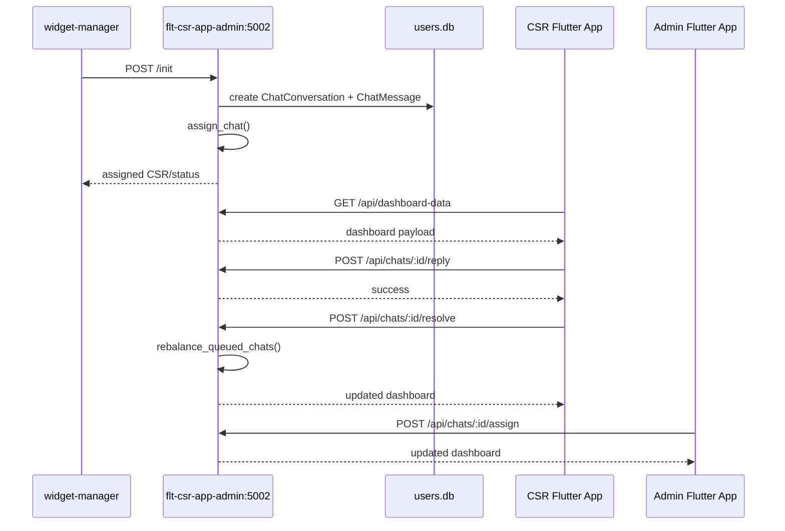

# Admin Flutter App And Multi-CSR API Guide

This file is only about building the admin/CSR Flutter app through the existing `flt-csr-app-admin` APIs, with focus on how multiple CSRs are handled.

## Runtime

- Service: `flt-csr-app-admin`
- Code: `/home/ubuntu/new_admin/flt_csr_app_ai/app.py`
- Port: `5002`
- Database: `/home/ubuntu/new_admin/flt_csr_app_ai/instance/users.db`

## What this backend handles

- escalated chats from the widget manager
- CSR and admin accounts
- CSR presence and availability
- chat queueing
- auto-assignment
- reassignment
- chat resolution
- relay back to widget manager

## Multi-CSR handling

Each CSR is stored as a row in `User`.

Important CSR fields:

- `is_active`
- `is_available`
- `max_concurrent_chats`
- `last_seen_at`
- `last_assigned_at`

Important chat table:

- `ChatConversation`

Important event table:

- `ChatAssignmentEvent`

Important transcript table:

- `ChatMessage`

## Online/offline logic

A CSR is treated as online if:

- `last_seen_at` exists
- it is within the last 60 seconds

So a CSR can be:

- active but offline
- active and online but unavailable
- active, online, available, and assignable

## Capacity logic

A CSR is eligible for new chats only if:

- active
- available
- online
- active chat count is less than `max_concurrent_chats`

## Auto-assignment logic

The backend uses:

- `assign_chat()`
- `rebalance_queued_chats()`
- `pick_best_csr()`

Best CSR selection order:

1. lowest active chat count
2. oldest `last_assigned_at`
3. oldest `created_at`
4. lowest `id`

If no CSR is eligible:

- chat becomes `queued`
- `assigned_csr_id` stays null

## Important APIs

### `GET /api/dashboard-data`

Purpose:

- load admin or CSR workspace data

Admin page-scoped usage:

- `/api/dashboard-data?page=overview`
- `/api/dashboard-data?page=credentials`
- `/api/dashboard-data?page=team`
- `/api/dashboard-data?page=chats`
- `/api/dashboard-data?page=activity`

CSR usage:

- `/api/dashboard-data`

### `GET /api/chats/<chat_id>/messages`

Purpose:

- load transcript and event history for one chat

### `POST /api/chats/<chat_id>/reply`

Purpose:

- CSR sends a live reply

Request:

```json
{
  "message": "Hello, I can help."
}
```

### `POST /api/chats/<chat_id>/resolve`

Purpose:

- resolve chat and send it back to AI

Request:

```json
{}
```

Important effect:

- after resolve, `rebalance_queued_chats()` runs

### `POST /api/chats/<chat_id>/assign`

Purpose:

- admin reassigns a chat

Request:

```json
{
  "csr_id": 7
}
```

Or auto-balance:

```json
{
  "csr_id": "auto"
}
```

### `POST /api/chats/rebalance`

Purpose:

- admin forces queue rebalance

### `POST /api/csrs/<user_id>/settings`

Purpose:

- update CSR availability and max capacity

Request:

```json
{
  "max_concurrent_chats": 4,
  "is_available": true
}
```

### `POST /api/admin/csrs/create`

Purpose:

- create new CSR login

Request:

```json
{
  "display_name": "Alice",
  "email": "alice@example.com",
  "password": "secret123",
  "max_concurrent_chats": 4,
  "is_available": true
}
```

### `POST /api/admin/integration-settings`

Purpose:

- update widget/relay settings used by admin app

## Public handoff APIs

These are called by the widget manager, but your admin Flutter app should understand them:

### `POST /init`

- create/update escalated chat
- import transcript
- run auto-assignment

### `POST /send`

- append visitor message after handoff

### `POST /cleanup`

- externally close/cleanup active handoff

## Flutter app structure

Recommended feature modules:

- `admin_overview`
- `admin_team`
- `admin_chats`
- `admin_activity`
- `admin_credentials`
- `csr_workspace`

Recommended API clients:

- `AdminApiClient`
- `CsrApiClient`

Important:

- this backend uses session cookies
- your Flutter app must persist cookies after login

## Polling

Recommended:

- admin overview/team/chats/activity: every `5 to 8 seconds`
- CSR workspace list: every `5 seconds`
- selected transcript: refresh after reply and periodically

## Ownership rules

- CSR can only reply to active chats assigned to them
- CSR cannot open another CSR's locked chat
- admin can view and reassign all chats

## Sequence diagram



